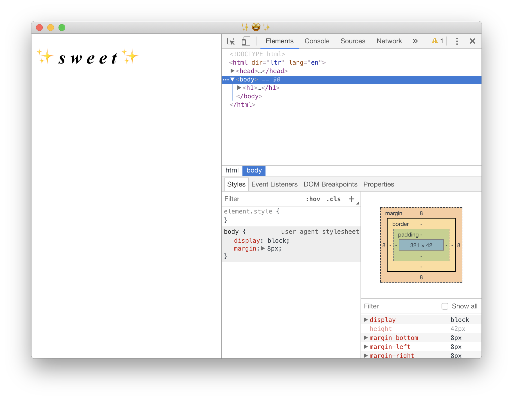

# electron-starter

> A super simple and lightweight starting point for your Electron-based app.

### Features
- ES7!
- Lightweight UI rendering via [choo](https://choo.io)!
- Minimal transpiling via select [Babel](https://babeljs.io) modules!
- Quick bundling via [rollup](https://rollupjs.org)!
- Sensible linting via [ESLint](https://eslint.org)!
- Not a shit-ton of dependencies! (I can't believe it's not bloat!)
- EXCLAMATIONS

### Installation
- `npm i`

### Development
- `npm start`

### Tests
- `npm test`

### License
Whatever the fuck you want. Do you know how **long** it took me to figure out how to put this together? _And make it up to date?_ A long-ass time. An overwhelming majority of the Internet is totally fine with a bajillion dependencies that do...who cares, I'm not adding all that shit to my projects. KISS my ass.

Together, you and I will make the Web a better place. Let's call this a silent movement, "show and prove," if you will. Beautiful apps are more than the interface. The plumbing should be nice, right? Lipstick on a pig is still paint on a ham sandwich. Respect yourself.

### TODO
- Add more meat to this. This is intended as a starting point for my own future apps.
- Add Sass files and package script.
